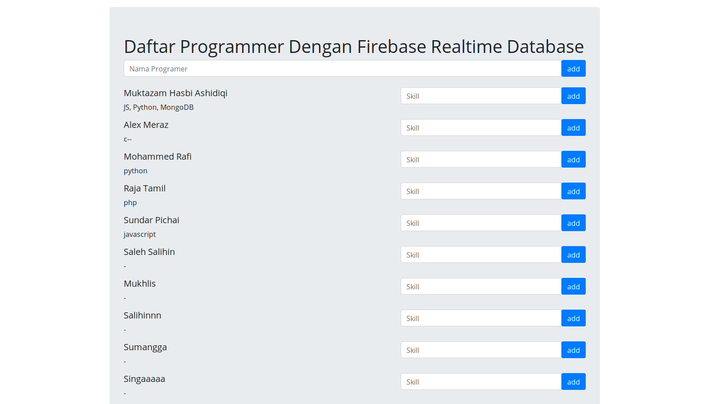

#1

REST API merupakan style arsitektur software yang digunakan untuk membuat web service. REST merupakan singkatan dari Representational State Transfer. Web service API yang menggunakan REST disebut sebagai RESTful API. JSON (JavaScript Object Notation) merupakan notasi penulisan data yang menggunakan teks yang dapat dibaca manusia. JSON memudahkan dalam penanganan data tanpa peduli dalam bahasa pemrograman apapun. Hasil return dari REST API berupa JSON.

Stack yang digunakan pada pengerjaan file pertama adalah php, dengan menggunakan fungsi 'json_encode' untuk mengubah array ke dalam bentuk JSON. Cara menjalankannya cukup dengan memanggil fungsi 'bioToJson' disertai dengan parameter nama, alamat, hobbi (berupa array), status pernikahan (berupa boolean true/false), nama sma, nama universitas, skill yang dimiliki (berupa array), dan nilai/score dari skill yang dimiliki (berupa array).

#2

Untuk mencocokkan string dengan pattern yang diinginkan cukup menggunakan regex. Regex (Regular Expression) merupakan kumpulan karakter yang mendefinisikan sebuah pattern. Soal dikerjakan dengan menggunakan bahasa JavaScript dengan membuat dua fungsi 'isUnameValid' dan 'isEmailValid' yang akan me-return tru/false tergantung dari input string yang diberikan.

#3

Soal dikerjakan dengan menggunakan bahasa pemrograman JavaScript dengan menggunakan bantuan fungsi bawaan 'Math.random()' untuk mengacak string yang telah disediakan. Setelah terbentuk string random sepanjang 32 karakter, string tersebut akan dicek apakah telah ada dalam array 'randStrings'. Untuk mengeceknya cukup dengan fungsi bawaan 'isInArray'. Bila string telah ada dalam array, maka akan menggenerate string random lagi dan melakukan pengecekan kembali, bila tidak ada string langsung dimasukkan dalam array. Return berupa array yang berisi string random sepanjang 32 karakter sejumlah yang diinputkan.

#4

Dikerjakan dengan bahasa pemrograman Python, cukup dengan menggunakan looping dan percabangan.

#5

Dikerjakan dengan bahasa pemgrograman JavaScript, data berupa array akan di-loop sejumlah panjang array. Selanjutnya mulai dari iterasi pertama element ke-0 data yang berupa array diurutkan menggunakan fungsi 'sort()', kemudian diambil nilai tertingginya dan dimasukkan ke dalam array baru. Begitu terus hingga elemen terakhir.

#6

Dikerjakan dengan vanilla JavaScript, Twitter Bootstrap, dan Firebase Realtime Database. Ini pertama kalinya saya menggunakan Firebase Realtime Database untuk dbms-nya. Kelebihannya adalah hanya membutuhkan satu halaman web (SPA) dan lebih hemat data (tidak perlu refersh halaman untuk melakukan update data).

###Tampilan
